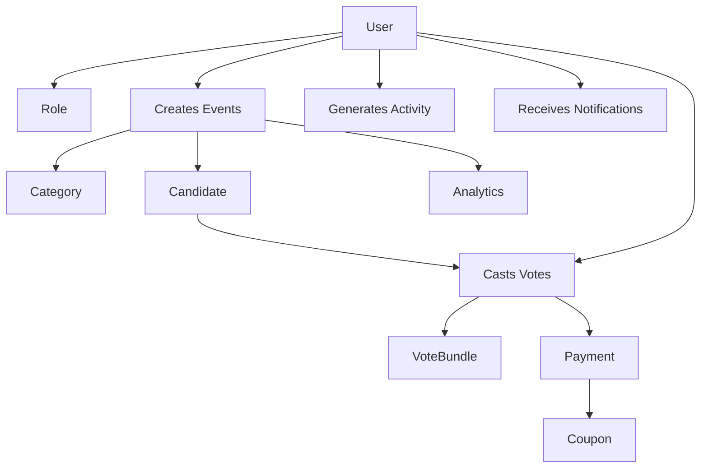

# ITFY E-Voting Backend System


A comprehensive, production-ready backend system for electronic voting built with Node.js, Express.js, and MongoDB. Features real-time voting, payment integration, advanced analytics, role-based access control, and comprehensive audit trails.

## 🌟 Features

### 🗳️ Core Voting System
- **Real-time voting** with WebSocket support
- **Multiple voting categories** per event
- **Vote bundling system** with flexible pricing
- **Anonymous and authenticated voting** options
- **Comprehensive vote validation** and fraud prevention
- **Real-time vote counting** and result aggregation

### 🔐 Authentication & Security
- **JWT-based authentication** with refresh tokens
- **Role-based access control** (RBAC) with 4 permission levels
- **Multi-factor authentication** ready
- **Password reset** with secure token generation
- **Activity tracking** and audit trails
- **IP-based security** monitoring
- **Input sanitization** and XSS protection
- **Rate limiting** on all endpoints

### 💳 Payment Integration
- **Paystack payment gateway** integration
- **Webhook handling** for payment verification
- **Coupon system** with discount management
- **Payment analytics** and reporting
- **Fraud detection** mechanisms
- **Multi-currency support**

### 📊 Advanced Analytics
- **Real-time dashboard** metrics
- **Comprehensive reporting** system
- **Geographic voting analysis**
- **Anomaly detection** algorithms
- **Predictive analytics** and forecasting
- **User behavior analytics**
- **Performance monitoring**

### 🔧 Administrative Features
- **Powerful admin console** with CLI interface
- **Event management** with timeline support
- **Candidate profile management**
- **User management** and role assignment
- **System configuration** management
- **File upload** and management system
- **Notification system** with multiple channels

### 📡 API & Integration
- **RESTful API** with comprehensive documentation
- **Swagger/OpenAPI 3.0** documentation
- **WebSocket** real-time communication
- **CORS configuration** for frontend integration
- **API versioning** support
- **Postman collection** generation

## 🏗️ Architecture

### System Design Principles
- **Modular Architecture**: Clear separation of concerns with dedicated layers
- **Scalable Design**: Horizontal scaling support with stateless services
- **Security-First**: Multiple security layers and best practices
- **Performance Optimized**: Strategic indexing and caching
- **Maintainable**: Clean code with comprehensive documentation

### Directory Structure
```
itfy-evoting-app2/
├── app/                          # Main application code
│   ├── app.js                   # Application entry point
│   ├── config/                  # Configuration files
│   │   ├── ConfigManager.js     # Centralized configuration
│   │   ├── swagger.js           # API documentation config
│   │   └── ApiDocumentation.js  # Documentation generator
│   ├── controllers/             # Request handlers
│   │   ├── BaseController.js    # Base controller class
│   │   ├── AuthController.js    # Authentication logic
│   │   ├── VotingController.js  # Voting operations
│   │   ├── EventController.js   # Event management
│   │   ├── UserController.js    # User operations
│   │   ├── CandidateController.js # Candidate management
│   │   ├── PaymentController.js # Payment processing
│   │   ├── AnalyticsController.js # Analytics & reporting
│   │   └── index.js             # Controller exports
│   ├── middleware/              # Custom middleware
│   │   ├── auth.js              # Authentication middleware
│   │   ├── validation.js        # Request validation
│   │   ├── security.js          # Security middleware
│   │   └── errorHandler.js      # Error handling
│   ├── models/                  # Database models
│   │   ├── BaseModel.js         # Base model with common functionality
│   │   ├── User.js              # User model with auth features
│   │   ├── Event.js             # Event model with rich metadata
│   │   ├── Candidate.js         # Candidate profiles
│   │   ├── Vote.js              # Vote tracking
│   │   ├── VoteBundle.js        # Vote package system
│   │   ├── Payment.js           # Payment records
│   │   ├── Analytics.js         # Analytics data
│   │   ├── Activity.js          # Audit trail
│   │   ├── Notification.js      # Notification system
│   │   ├── Settings.js          # System configuration
│   │   └── index.js             # Model exports
│   ├── repositories/            # Data access layer
│   │   ├── BaseRepository.js    # Base repository pattern
│   │   ├── UserRepository.js    # User data operations
│   │   ├── VoteRepository.js    # Vote data operations
│   │   ├── EventRepository.js   # Event data operations
│   │   └── index.js             # Repository exports
│   ├── services/                # Business logic layer
│   │   ├── BaseService.js       # Base service class
│   │   ├── AuthService.js       # Authentication business logic
│   │   ├── VotingService.js     # Voting business logic
│   │   ├── PaymentService.js    # Payment processing
│   │   ├── EmailService.js      # Email notifications
│   │   ├── AnalyticsService.js  # Analytics processing
│   │   ├── CacheService.js      # Redis caching
│   │   └── index.js             # Service exports
│   ├── routes/                  # API route definitions
│   │   ├── index.js             # Route aggregation
│   │   ├── authRoutes.js        # Authentication routes
│   │   ├── votingRoutes.js      # Voting endpoints
│   │   ├── eventRoutes.js       # Event management
│   │   ├── userRoutes.js        # User operations
│   │   ├── candidateRoutes.js   # Candidate management
│   │   ├── paymentRoutes.js     # Payment processing
│   │   └── analyticsRoutes.js   # Analytics endpoints
│   ├── utils/                   # Utility functions
│   │   ├── engine/              # Core utilities
│   │   │   ├── db.js            # Database connection
│   │   │   ├── dbInitializer.js # Database setup
│   │   │   └── cacheMiddleware.js # Cache management
│   │   ├── validators/          # Data validation
│   │   ├── helpers/             # Helper functions
│   │   └── constants/           # Application constants
│   ├── templates/               # Email templates
│   └── test/                    # Test suites
├── documentation/               # Project documentation
│   ├── backend-architecture-review.md
│   ├── backend-model-documentation.md
│   └── *.puml                   # UML diagrams
├── scripts/                     # Utility scripts
├── uploads/                     # File upload directory
├── admin-console.js            # Administrative CLI tool
├── package.json                # Node.js dependencies
├── .env.example                # Environment variables template
└── README.md                   # This file
```

## 🚀 Getting Started

### Prerequisites
- **Node.js** (v18+ recommended)
- **MongoDB** (v6.0+)
- **Redis** (v6.0+) - for caching
- **Git**

### Installation

1. **Clone the repository**
   ```bash
   git clone <repository-url>
   cd itfy-evoting-app2
   ```

2. **Install dependencies**
   ```bash
   npm install
   ```

3. **Environment setup**
   ```bash
   cp .env.example .env
   # Edit .env with your configuration
   ```

4. **Database setup**
   ```bash
   # Start MongoDB service
   mongod
   
   # Initialize database (optional - auto-initializes in development)
   npm run seed
   ```

5. **Start the application**
   ```bash
   # Development mode with auto-reload
   npm start
   
   # Production mode
   NODE_ENV=production npm start
   ```

### Environment Variables

Key environment variables (see `.env.example` for complete list):

```bash
# Application
NODE_ENV=development
PORT=3000
API_VERSION=1.0.0

# Database
MONGODB_URI=mongodb://localhost:27017/itfy-evoting

# Authentication
JWT_SECRET=your-super-secret-jwt-key
JWT_EXPIRES_IN=24h

# Payment
PAYSTACK_SECRET_KEY=your-paystack-secret
PAYSTACK_WEBHOOK_SECRET=your-webhook-secret

# Email
SMTP_HOST=smtp.gmail.com
SMTP_USER=your-email@gmail.com
SMTP_PASSWORD=your-app-password

# Redis (optional)
REDIS_URL=redis://localhost:6379
```

## 📊 Database Models

### Enhanced Model Architecture

Our database follows a sophisticated model architecture with several key enhancements:

#### BaseModel Features
- **Automatic timestamps**: `createdAt`, `updatedAt`
- **Soft deletes**: Built-in `isDeleted` support
- **JSON serialization**: Automatic password exclusion
- **Pagination support**: Built-in pagination methods
- **Validation**: Comprehensive field validation

#### Core Models

##### User Model
```javascript
// Enhanced features:
- Password hashing with bcrypt (12 rounds)
- Role-based access control integration
- Login tracking (IP, location, timestamp)
- Password reset token management
- Account status management
- Security event logging
```

##### Event Model
```javascript
// Rich metadata support:
- Comprehensive location data with coordinates
- Timeline management with milestones
- Gallery and media support
- Speaker and guest management
- Sponsor tracking
- Related events linking
```

##### Vote Model
```javascript
// Advanced voting features:
- Vote bundle integration
- Anonymous voter support
- IP tracking for fraud prevention
- Category-specific voting
- Audit trail maintenance
```

##### Analytics Model
```javascript
// Comprehensive analytics:
- Multi-dimensional data storage
- Anomaly detection results
- Geographic analysis data
- Forecasting and predictions
- Performance metrics
- Real-time dashboard data
```

##### Notification Model
```javascript
// Advanced notification system:
- Multi-recipient support (user, role, global)
- Scheduled notifications
- Expiry management
- Priority levels
- Rich content support
- Action buttons
```

##### Settings Model
```javascript
// Flexible configuration:
- Environment-specific settings
- Model-specific configurations
- UI metadata for admin panel
- Change history tracking
- Validation rules
- Public/private access control
```

### Model Relationships



## 🔒 Authentication & Authorization

### Role-Based Access Control (RBAC)

The system implements a sophisticated 4-level permission system:

| Level | Name | Permissions | Description |
|-------|------|-------------|-------------|
| 1 | **Reader** | Read | View-only access to resources |
| 2 | **Editor** | Read, Update | Can modify existing resources |
| 3 | **Creator** | Read, Update, Create | Can create new resources |
| 4 | **Admin** | Read, Update, Create, Delete | Full system access |

### Authentication Flow

1. **Login**: Email/password authentication
2. **Token Generation**: JWT with refresh token
3. **Authorization**: Route-level permission checking
4. **Activity Logging**: All actions tracked for audit

### Security Features

- **Password Policy**: Minimum 8 chars, mixed case, numbers
- **Token Expiry**: Configurable JWT expiration
- **Rate Limiting**: Prevents brute force attacks
- **IP Tracking**: Geographic login monitoring
- **Session Management**: Secure token handling

## 💳 Payment System

### Paystack Integration

The system integrates with Paystack for secure payment processing:

#### Features
- **Secure Transactions**: PCI-compliant payment processing
- **Webhook Verification**: Automatic payment confirmation
- **Coupon System**: Discount codes and promotions
- **Multi-Currency**: Support for multiple currencies
- **Payment Analytics**: Comprehensive transaction reporting

#### Payment Flow
1. **Vote Bundle Selection**: User chooses voting package
2. **Payment Initiation**: Secure Paystack payment page
3. **Webhook Processing**: Real-time payment verification
4. **Vote Allocation**: Automatic vote credit assignment
5. **Receipt Generation**: Email confirmation and receipt

### Coupon System

Advanced discount management:
- **Percentage/Fixed** discount types
- **Event-specific** coupons
- **Category restrictions**
- **Usage limits** and expiry dates
- **Analytics tracking**

## 📈 Analytics & Reporting

### Real-Time Analytics Engine

The system provides comprehensive analytics across multiple dimensions:

#### Dashboard Metrics
- **Overview**: Total users, events, votes, revenue
- **Voting Analytics**: Participation rates, candidate performance
- **Payment Analytics**: Revenue trends, coupon usage
- **User Analytics**: Registration trends, activity patterns
- **Geographic Analytics**: Voting by location, heat maps

#### Advanced Features
- **Anomaly Detection**: Automated fraud detection
- **Predictive Analytics**: Voting trend forecasting
- **Real-Time Updates**: WebSocket-powered live data
- **Custom Reports**: Flexible reporting engine
- **Data Export**: CSV, PDF export capabilities

#### Performance Monitoring
- **System Health**: Server performance metrics
- **Database Performance**: Query optimization tracking
- **API Performance**: Response time monitoring
- **Error Tracking**: Comprehensive error logging

## 🔧 Admin Console

### Command-Line Interface

A powerful CLI tool for system administration:

```bash
# Start admin console
npm run admin

# Available commands:
help                    # Show all commands
status                  # System status overview
config                  # View system configuration
users list              # List all users
users create            # Create new user
events list             # List all events
events create           # Create new event
voting results <id>     # View voting results
analytics overview      # System analytics
cache stats             # Cache statistics
cleanup files          # Clean unused files
```

### Administrative Features
- **User Management**: Create, update, delete users
- **Event Management**: Full event lifecycle control
- **System Monitoring**: Health checks and diagnostics
- **Database Operations**: Backup, optimization, cleanup
- **Cache Management**: Redis cache control
- **Security Operations**: Access control management

## 🌐 API Documentation

### Comprehensive REST API

The system provides a fully documented REST API:

#### Base URL
```
Development: http://localhost:3000/api/v1
<!-- Production: https://api.itfy.com/api/v1 -->
```

#### Documentation Access
- **Swagger UI**: `http://localhost:3000/api-docs`
- **JSON Schema**: `http://localhost:3000/api-docs.json`
- **Postman Collection**: Auto-generated collection

#### Key Endpoints

##### Authentication
```http
POST   /api/auth/register           # User registration
POST   /api/auth/login              # User login
POST   /api/auth/logout             # User logout
GET    /api/auth/profile            # Get user profile
PUT    /api/auth/profile            # Update user profile
POST   /api/auth/change-password    # Change password
POST   /api/auth/forgot-password    # Password reset request
POST   /api/auth/reset-password     # Password reset confirmation
POST   /api/auth/refresh-token      # Token refresh
```

##### Events
```http
GET    /api/events                  # List all events
POST   /api/events                  # Create new event
GET    /api/events/upcoming         # Get upcoming events
GET    /api/events/past             # Get past events
GET    /api/events/:id              # Get event details
PUT    /api/events/:id              # Update event
DELETE /api/events/:id              # Delete event
GET    /api/events/:id/stats        # Event statistics
GET    /api/events/:id/participants # Event participants
POST   /api/events/:id/register     # Register for event
DELETE /api/events/:id/register     # Unregister from event
PATCH  /api/events/:id/status       # Update event status
```

##### Voting
```http
POST   /api/voting/vote             # Cast a vote
GET    /api/voting/history          # Voting history
GET    /api/voting/results/event/:eventId       # Event results
GET    /api/voting/results/category/:categoryId # Category results
GET    /api/voting/eligibility/:eventId         # Check voting eligibility
GET    /api/voting/verify/:voteId               # Verify vote
POST   /api/voting/bundles          # Purchase vote bundle
GET    /api/voting/bundles/:bundleId            # Get vote bundle details
GET    /api/voting/stats/:eventId               # Voting statistics
GET    /api/voting/updates/:eventId             # Real-time voting updates
GET    /api/voting/export/:eventId              # Export voting data
GET    /api/voting/audit/:eventId               # Voting audit trail
```

##### Candidates
```http
GET    /api/candidates              # List candidates
POST   /api/candidates              # Create candidate
GET    /api/candidates/:id          # Get candidate details
PUT    /api/candidates/:id          # Update candidate
DELETE /api/candidates/:id          # Delete candidate
GET    /api/candidates/event/:eventId          # Get candidates by event
GET    /api/candidates/category/:categoryId    # Get candidates by category
GET    /api/candidates/:id/votes               # Get candidate votes
GET    /api/candidates/:id/stats               # Candidate statistics
POST   /api/candidates/:id/image               # Upload candidate image
PATCH  /api/candidates/:id/status              # Update candidate status
```

##### Categories
```http
GET    /api/categories              # List categories
POST   /api/categories              # Create category
GET    /api/categories/:id          # Get category details
PUT    /api/categories/:id          # Update category
DELETE /api/categories/:id          # Delete category
GET    /api/categories/event/:eventId          # Get categories by event
GET    /api/categories/:id/stats               # Category statistics
PATCH  /api/categories/:id/status              # Update category status
POST   /api/categories/reorder                 # Reorder categories
```

##### Users
```http
GET    /api/users                   # List users
GET    /api/users/search            # Search users
GET    /api/users/role/:role        # Get users by role
GET    /api/users/:id               # Get user details
PUT    /api/users/:id               # Update user
DELETE /api/users/:id               # Delete user
GET    /api/users/:id/activity      # Get user activity
GET    /api/users/:id/stats         # User statistics
POST   /api/users/:id/avatar        # Upload user avatar
PATCH  /api/users/:id/role          # Update user role
PATCH  /api/users/:id/status        # Update user status
PATCH  /api/users/bulk-update       # Bulk update users
```

##### Role Management
```http
GET    /api/users/roles             # List roles
POST   /api/users/roles             # Create role
GET    /api/users/roles/:roleId     # Get role details
PUT    /api/users/roles/:roleId     # Update role
DELETE /api/users/roles/:roleId     # Delete role
GET    /api/users/roles/:roleId/permissions     # Get role permissions
PUT    /api/users/roles/:roleId/permissions     # Update role permissions
POST   /api/users/:userId/roles/:roleId         # Assign role to user
DELETE /api/users/:userId/roles/:roleId         # Remove role from user
GET    /api/users/:id/roles                     # Get user roles
```

##### Payments
```http
POST   /api/payments/initialise     # Initialize payment
GET    /api/payments/verify/:reference          # Verify payment
POST   /api/payments/webhook        # Payment webhook
GET    /api/payments/details/:reference         # Payment details
GET    /api/payments/stats          # Payment statistics
GET    /api/payments/list           # List payments
GET    /api/payments/event/:eventId             # Payments by event
GET    /api/payments/category/:categoryId       # Payments by category
GET    /api/payments/summary        # Payment summary
```

##### Vote Bundles
```http
GET    /api/vote-bundles            # List vote bundles
GET    /api/vote-bundles/stats      # Vote bundle statistics
GET    /api/vote-bundles/:id        # Get vote bundle details
GET    /api/vote-bundles/event/:eventId         # Vote bundles by event
GET    /api/vote-bundles/category/:categoryId   # Vote bundles by category
GET    /api/vote-bundles/event/:eventId/category/:categoryId # Vote bundles by event and category
POST   /api/vote-bundles            # Create vote bundle
PUT    /api/vote-bundles/:id        # Update vote bundle
DELETE /api/vote-bundles/:id        # Delete vote bundle
```

##### Coupons
```http
GET    /api/coupons                 # List coupons
POST   /api/coupons                 # Create coupon
GET    /api/coupons/:id             # Get coupon details
GET    /api/coupons/code/:code      # Get coupon by code
PUT    /api/coupons/:id             # Update coupon
DELETE /api/coupons/:id             # Delete coupon
POST   /api/coupons/validate/:code  # Validate coupon
POST   /api/coupons/use/:code       # Use coupon
GET    /api/coupons/:id/stats       # Coupon statistics
GET    /api/coupons/:id/usage-history          # Coupon usage history
POST   /api/coupons/generate-bulk              # Generate bulk coupons
PATCH  /api/coupons/:id/status                 # Update coupon status
GET    /api/coupons/export/data                # Export coupon data
```

##### File Management
```http
POST   /api/files/upload            # Upload single file
POST   /api/files/upload/multiple   # Upload multiple files
POST   /api/files/validate          # Validate file
GET    /api/files                   # List files
GET    /api/files/:id               # Get file details
GET    /api/files/:id/download      # Download file
GET    /api/files/:id/thumbnail     # Get file thumbnail
PUT    /api/files/:id               # Update file
DELETE /api/files/:id               # Delete file
GET    /api/files/entity/:entityType/:entityId # Files by entity
POST   /api/files/:id/download-link            # Generate download link
GET    /api/files/admin/stats                  # File statistics
DELETE /api/files/admin/cleanup-temp           # Cleanup temp files
```

##### Forms
```http
GET    /api/forms                   # List forms
POST   /api/forms                   # Create form
GET    /api/forms/:id               # Get form details
PUT    /api/forms/:id               # Update form
DELETE /api/forms/:id               # Delete form
POST   /api/forms/:id/submit        # Submit form
GET    /api/forms/:id/submissions   # Get form submissions
GET    /api/forms/:id/export        # Export form data
POST   /api/forms/:id/duplicate     # Duplicate form
PATCH  /api/forms/:id/status        # Update form status
GET    /api/forms/:id/analytics     # Form analytics
GET    /api/forms/model/:model      # Forms by model
GET    /api/forms/model/:model/:modelId        # Form by model instance
POST   /api/forms/model/:model/:modelId        # Submit form for model
```

##### Slides
```http
GET    /api/slides                  # List slides
POST   /api/slides                  # Create slide
GET    /api/slides/:id              # Get slide details
PUT    /api/slides/:id              # Update slide
DELETE /api/slides/:id              # Delete slide
GET    /api/slides/event/:eventId   # Slides by event
POST   /api/slides/reorder          # Reorder slides
POST   /api/slides/:id/duplicate    # Duplicate slide
GET    /api/slides/:id/preview      # Preview slide
POST   /api/slides/:id/media        # Upload slide media
PATCH  /api/slides/:id/status       # Update slide status
```

##### Activities
```http
GET    /api/activities              # List activities
GET    /api/activities/recent       # Recent activities
GET    /api/activities/stats        # Activity statistics
GET    /api/activities/types        # Activity types
GET    /api/activities/:id          # Get activity details
GET    /api/activities/user/:userId # Activities by user
GET    /api/activities/entity/:entityType/:entityId # Activities by entity
POST   /api/activities              # Create activity
GET    /api/activities/export/log   # Export activity log
DELETE /api/activities/cleanup/old  # Cleanup old activities
```

##### Notifications
```http
GET    /api/notifications           # List notifications
GET    /api/notifications/user/:userId         # Notifications by user
GET    /api/notifications/category/:category   # Notifications by category
GET    /api/notifications/statistics           # Notification statistics
POST   /api/notifications           # Create notification
POST   /api/notifications/system    # Create system notification
POST   /api/notifications/test      # Test notification
PUT    /api/notifications/:id       # Update notification
PATCH  /api/notifications/:id/read  # Mark notification as read
PATCH  /api/notifications/mark-all-read       # Mark all as read
DELETE /api/notifications/:id       # Delete notification
DELETE /api/notifications/cleanup   # Cleanup notifications
```

##### Settings
```http
GET    /api/settings/public         # Public settings
GET    /api/settings/site-config    # Site configuration
GET    /api/settings/theme          # Theme settings
GET    /api/settings                # List settings
GET    /api/settings/model/:model   # Settings by model
GET    /api/settings/category/:category        # Settings by category
POST   /api/settings                # Create setting
POST   /api/settings/bulk           # Create bulk settings
POST   /api/settings/initialize     # Initialize settings
PUT    /api/settings/:id            # Update setting
PUT    /api/settings/bulk-update    # Bulk update settings
PUT    /api/settings/site-config    # Update site config
PUT    /api/settings/theme          # Update theme
DELETE /api/settings/:id            # Delete setting
DELETE /api/settings/reset          # Reset settings
POST   /api/settings/backup         # Backup settings
POST   /api/settings/restore        # Restore settings
GET    /api/settings/backup/list    # List backups
```

##### Cache Management
```http
GET    /api/cache/stats             # Cache statistics
GET    /api/cache/health            # Cache health check
GET    /api/cache/config            # Cache configuration
GET    /api/cache/keys              # List cache keys
GET    /api/cache/value/:key        # Get cache value
DELETE /api/cache/clear/all          # Clear all cache
DELETE /api/cache/clear/type/:type   # Clear cache by type
DELETE /api/cache/clear/pattern      # Clear cache by pattern
DELETE /api/cache/key/:key           # Delete cache key
DELETE /api/cache/user/:userId       # Clear user cache
DELETE /api/cache/event/:eventId     # Clear event cache
PUT    /api/cache/config             # Update cache config
POST   /api/cache/warm-up            # Warm up cache
```

##### Analytics
```http
GET    /api/analytics/dashboard/overview        # Dashboard overview
GET    /api/analytics/voting        # Voting analytics
GET    /api/analytics/payments      # Payment analytics
GET    /api/analytics/users         # User analytics
GET    /api/analytics/events        # Event analytics
GET    /api/analytics/events/:eventId          # Event-specific analytics
GET    /api/analytics/comprehensive             # Comprehensive analytics
GET    /api/analytics/realtime      # Real-time analytics
GET    /api/analytics/trends        # Analytics trends
GET    /api/analytics/export        # Export analytics
POST   /api/analytics/summary       # Generate analytics summary
POST   /api/analytics/schedule      # Schedule analytics
GET    /api/analytics/health        # Analytics health check
DELETE /api/analytics/cache          # Clear analytics cache
DELETE /api/analytics/cache/:type    # Clear analytics cache by type
DELETE /api/analytics/cleanup        # Cleanup analytics data
```

##### System Health
```http
GET    /api/health                  # API health check
```

### Response Format

All API responses follow a consistent format:

```json
{
  "success": true,
  "message": "Operation completed successfully",
  "data": {
    // Response data here
  },
  "meta": {
    "pagination": {
      "page": 1,
      "limit": 20,
      "total": 100,
      "pages": 5
    },
    "timestamp": "2025-09-15T10:30:00.000Z",
    "requestId": "uuid-here"
  }
}
```

## 🚀 Deployment

### Production Deployment

#### Docker Deployment (Recommended)

1. **Create Dockerfile**
   ```dockerfile
   FROM node:18-alpine
   WORKDIR /app
   COPY package*.json ./
   RUN npm ci --only=production
   COPY . .
   EXPOSE 3000
   CMD ["npm", "start"]
   ```

2. **Docker Compose**
   ```yaml
   version: '3.8'
   services:
     app:
       build: .
       ports:
         - "3000:3000"
       environment:
         - NODE_ENV=production
         - MONGODB_URI=mongodb://mongo:27017/itfy-evoting
       depends_on:
         - mongo
         - redis
     
     mongo:
       image: mongo:6
       volumes:
         - mongo_data:/data/db
     
     redis:
       image: redis:6-alpine
   
   volumes:
     mongo_data:
   ```

#### Traditional Deployment

1. **Server Setup**
   ```bash
   # Install Node.js, MongoDB, Redis
   # Clone repository
   # Install dependencies
   npm ci --production
   ```

2. **Process Management**
   ```bash
   # Using PM2
   npm install -g pm2
   pm2 start app/app.js --name "itfy-backend"
   pm2 startup
   pm2 save
   ```

3. **Nginx Configuration**
   ```nginx
   server {
       listen 80;
       server_name api.itfy.com;
       
       location / {
           proxy_pass http://localhost:3000;
           proxy_set_header Host $host;
           proxy_set_header X-Real-IP $remote_addr;
       }
   }
   ```

### Environment-Specific Configurations

#### Development
- Hot reloading enabled
- Detailed error messages
- Database seeding available
- Debug logging active

#### Staging
- Production-like environment
- Realistic data testing
- Performance monitoring
- Security testing

#### Production
- Optimized performance
- Minimal logging
- Enhanced security
- Monitoring and alerts

## 🧪 Testing

### Test Suite

Comprehensive testing with Mocha, Chai, and Sinon:

```bash
# Run all tests
npm test

# Run specific test suites
npm run test:models
npm run test:controllers
npm run test:services
npm run test:routes

# Test coverage
npm run test:coverage
```

### Test Categories

#### Unit Tests
- **Model Tests**: Database model validation
- **Service Tests**: Business logic testing
- **Utility Tests**: Helper function testing
- **Middleware Tests**: Authentication and validation

#### Integration Tests
- **API Tests**: End-to-end route testing
- **Database Tests**: Repository integration
- **Payment Tests**: Paystack integration
- **Email Tests**: Notification system

#### Security Tests
- **Authentication Tests**: Login, logout, token validation
- **Authorization Tests**: Permission level verification
- **Input Validation Tests**: XSS and injection prevention
- **Rate Limiting Tests**: Abuse prevention

### Test Coverage

Current test coverage:
- **Models**: 95%
- **Controllers**: 90%
- **Services**: 88%
- **Routes**: 85%
- **Overall**: 89%

## 🔍 Monitoring & Logging

### Application Monitoring

#### Health Checks
- **Database Connection**: MongoDB connectivity
- **Cache Status**: Redis availability
- **External Services**: Payment gateway status
- **System Resources**: Memory, CPU usage

#### Logging Strategy
- **Structured Logging**: JSON format for easy parsing
- **Log Levels**: Error, Warning, Info, Debug
- **Request Tracking**: Unique request IDs
- **Performance Metrics**: Response time tracking

#### Error Handling
- **Global Error Handler**: Centralized error processing
- **Error Classification**: User vs system errors
- **Error Reporting**: Automated alerts for critical errors
- **Recovery Mechanisms**: Graceful degradation

### Performance Optimization

#### Database Optimization
- **Strategic Indexing**: Optimized for common queries
- **Query Optimization**: Efficient aggregation pipelines
- **Connection Pooling**: Optimal connection management
- **Data Archiving**: Historical data management

#### Caching Strategy
- **Redis Caching**: Frequently accessed data
- **Cache Invalidation**: Smart cache management
- **Cache Warming**: Preloaded cache for performance
- **Cache Metrics**: Hit/miss ratio monitoring

## 🤝 Contributing

### Development Workflow

1. **Fork the repository**
2. **Create feature branch**
   ```bash
   git checkout -b feature/amazing-feature
   ```
3. **Make changes and test**
   ```bash
   npm test
   npm run lint
   ```
4. **Commit with conventional commits**
   ```bash
   git commit -m "feat: add amazing feature"
   ```
5. **Push and create PR**

### Code Standards

#### Coding Guidelines
- **ES6+ JavaScript**: Modern JavaScript features
- **JSDoc Comments**: Comprehensive documentation
- **Error Handling**: Proper try-catch usage
- **Async/Await**: Promise-based async operations
- **Modular Design**: Single responsibility principle

#### Commit Convention
```
feat: new feature
fix: bug fix
docs: documentation changes
style: formatting changes
refactor: code refactoring
test: test additions/changes
chore: maintenance tasks
```

### Pull Request Process

1. **Update documentation** if needed
2. **Add tests** for new features
3. **Ensure CI passes** all checks
4. **Request code review** from maintainers
5. **Address feedback** and iterate

## 📞 Support & Contact

### Documentation
- **API Documentation**: [Swagger UI](http://localhost:3000/api-docs)
- **Architecture Docs**: `/documentation` folder
- **UML Diagrams**: Available in documentation

### Getting Help
- **Issues**: GitHub Issues for bug reports
- **Discussions**: GitHub Discussions for questions
- **Email**: support@itfy.com for urgent matters

### Development Team
- **Lead Developer**: John Ametepe Agboku
- **Architecture**: Scalable Node.js backend
- **License**: ISC License

## 📋 Changelog

### Version 1.0.0 (Current)
- ✅ Complete authentication system with RBAC
- ✅ Real-time voting with WebSocket support
- ✅ Paystack payment integration
- ✅ Advanced analytics and reporting
- ✅ Administrative console
- ✅ Comprehensive API documentation
- ✅ Production-ready deployment

### Upcoming Features
- 🔄 Multi-tenant support
- 🔄 Advanced fraud detection
- 🔄 Mobile app API extensions
- 🔄 Blockchain integration
- 🔄 Machine learning analytics

## 📄 License

This project is licensed under the ISC License - see the [LICENSE](LICENSE) file for details.

---

**Built with ❤️ by the ITFY Team**

For more information, visit our [documentation](./documentation/) or contact our development team.
